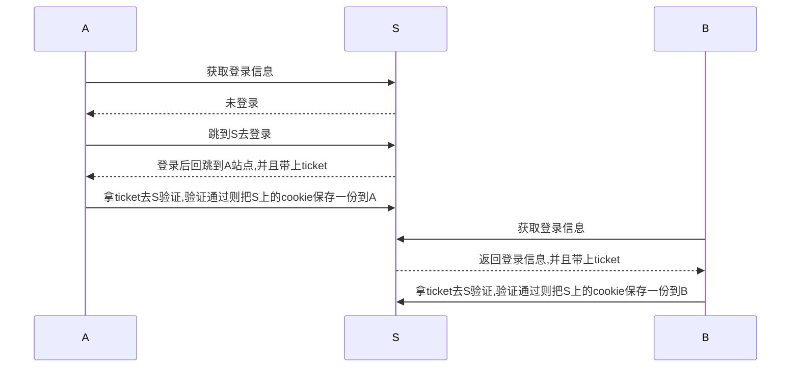

## SSO单点登录流程

* 本实验使用http测试,实际使用时建议使用https
* 淘宝使用的是方案一,每次页面访问时候都去login_api获取登录信息,来判断是同步登录还是同步登出

### 简称：

> 1. 站点(A): www.example1.com 
> 2. 站点(B): www.example2.com
> 3. SSO站点(S): sso.example3.com

要解决跨域问题



## 验证方式

1. 在浏览器打开 http://sso.example3.com ，这个会设置session和cookie
2. 在浏览器打开 http://www.example1.com ，抓包或使用开发者工具查看login_api的响应结果
3. 在浏览器打开 http://www.example2.com ，抓包或使用开发者工具查看login_api的响应结果

## 解决方案

> 参考了taobao、tmall的单点方式

### 方案一

以下为jsonp请求方式,只为验证跨站的cookie和session是否能正常获取

#### A
```js
$(function(){
    $.getScript('http://sso.example3.com/login_api')
})
```

#### B
```js
$(function(){
    $.getScript('http://sso.example3.com/login_api')
})
```

#### S
```php
$response = [
    'session' => $_SESSION,
    'session_id' => session_id(),
    'cookie' => $_COOKIE,
    'server' => $_SERVER,
    'code' => 0
];
// 可以打开sesure和httponly
session_set_cookie_params(3600, '/', '.sso.example3.com', true, true);

ob_clean();
header('Content-type:application/x-javascript');
echo 'var v=' . json_encode($response, JSON_PARTIAL_OUTPUT_ON_ERROR) . ';';
```

### 方案二

以下为json请求方式,只为验证跨站的cookie和session是否能正常获取

#### A
```js
$(function(){
    $.ajax({
        url: 'http://sso.example3.com/login_api',
        // 这个一定要添加,否则每次请求,S站的session_id每次都变化
        xhrFields: {
            withCredentials: true
        },
        success: function(response) {
            console.log(response)
        }
    })
})
```

#### B
```js
$(function(){
    $.ajax({
        url: 'http://sso.example3.com/login_api',
        xhrFields: {
            withCredentials: true
        },
        success: function(response) {
            console.log(response)
        }
    })
})
```

#### S
```php
$response = [
    'session' => $_SESSION,
    'session_id' => session_id(),
    'cookie' => $_COOKIE,
    'server' => $_SERVER,
    'code' => 0
];

session_set_cookie_params(3600, '/', '.sso.example3.com', true, true);
$allowOriginConfig = [
    'http://www.example1.com',
    'http://www.example2.com',
];
// P3P: Platform for Privacy Preferences, 是W3C公布的一项隐私保护推荐标准，以为用户提供隐私保护。
// P3P标准的构想是：Web 站点的隐私策略应该告之访问者该站点所收集的信息类型、信息将提供给哪些人、信息将被保留多少时间及其使用信息的方式，如站点应做诸如 “本网站将监测您所访问的页面以提高站点的使用率”或“本网站将尽可能为您提供更合适的广告”等申明。访问支持P3P网站的用户有权查看站点隐私报告，然后决定是否接受cookie 或是否使用该网站。
// 在Firefox不发送P3P也能跨域成功
header("P3P: CP='CURa ADMa DEVa PSAo PSDo OUR BUS UNI PUR INT DEM STA PRE COM NAV OTC NOI DSP COR'");
// 不一定所有浏览器都支持HTTP_ORIGIN,实际使用时要确认一下
$httpOrigin = isset($_SERVER['HTTP_ORIGIN']) ? $_SERVER['HTTP_ORIGIN'] : '';
if ($httpOrigin && in_array($httpOrigin, $allowOriginConfig)) {
    // 这里不能使用 Access-Control-Allow-Origin:*
    header("Access-Control-Allow-Origin:" . $httpOrigin);
}

header("Access-Control-Allow-Credentials:true");
header("Access-Control-Max-Age:3600");
ob_clean();
header('Content-type:application/json;charset=utf-8');
//指定JSON_PARTIAL_OUTPUT_ON_ERROR,避免$data中有非utf-8字符导致json编码返回false
echo json_encode($response, JSON_PARTIAL_OUTPUT_ON_ERROR);
exit;
```